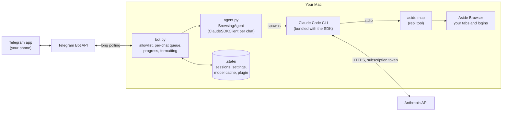

# aside-telegram

[](https://github.com/emanuilo/aside-telegram-bot/actions/workflows/ci.yml)
[](LICENSE)
[](https://www.python.org/downloads/)
[](https://pypi.org/project/claude-agent-sdk/)

**A browsing agent in your pocket.** aside-telegram is a Telegram bot that
hands your messages to a [Claude Agent SDK](https://pypi.org/project/claude-agent-sdk/)
agent, which drives your real [Aside Browser](https://asidehq.com) through
Aside's MCP server. Ask it to check an order, read a page or fill in a form from
your phone; it works in your own browser with your own logins, shows its
progress step by step, sends screenshots, and asks before doing anything
irreversible. It runs on your Mac and bills your Claude subscription, not API
credits.

## Disclaimer

This is an unofficial, community project. It is **not affiliated with,
endorsed by or supported by Anthropic, Aside or Telegram**.

The agent acts in **your real browser**, which may be signed in to your
accounts. AI agents make mistakes and can be manipulated by content on the
pages they read. **Use it at your own risk** and read [SECURITY.md](SECURITY.md)
first.

The bot uses your Claude subscription through a token from
`claude setup-token` (or your local Claude Code login). Make sure your use
complies with [Anthropic's terms](https://www.anthropic.com/legal) and usage
policies for your plan.

## Features

- **Real browser control.** The agent's browser tool is Aside's `repl`
  (Playwright-style JavaScript in your Aside Browser), so it sees your tabs,
  cookies and logins.
- **Subscription billing only.** Uses `CLAUDE_CODE_OAUTH_TOKEN` or your local
  Claude Code login. `ANTHROPIC_API_KEY` and other provider credentials are
  always scrubbed.
- **Allowlist.** Only the Telegram user IDs you list can use it; it won't start
  without the list.
- **Locked down.** No shell or file tools, no `~/.claude` settings, CLAUDE.md,
  plugins or other MCP servers: just the aside `repl` and an allowlisted set of
  skills.
- **Asks first.** Instructed to confirm in chat before purchases, sending
  messages, posting, submitting forms, deleting, changing settings or accepting
  terms.
- **Password manager sign-in.** Can sign in with the browser's 1Password
  autofill when a task needs it; never types secrets from chat.
- **Persistent conversations.** One conversation per chat, resumed after
  restarts.
- **Live progress.** A typing indicator, a status line with the current browser
  step, `/stop` to interrupt, and a queue for messages sent mid-task.
- **Model and effort switching.** `/model` and `/effort` with the model list
  discovered from Anthropic's API, so new models show up on their own.
- **Phone-friendly replies.** Markdown converted to Telegram HTML, long replies
  split, screenshots forwarded as photos.

## Requirements

- **macOS** with the [Aside Browser](https://asidehq.com) and its CLI
  installed (`aside mcp` must work).
- A **Claude subscription** (Pro or Max) and
  [Claude Code](https://docs.anthropic.com/en/docs/claude-code) to create a
  token. The Agent SDK bundles the Claude Code CLI it runs.
- A **Telegram bot** token from [@BotFather](https://t.me/BotFather).
- [uv](https://docs.astral.sh/uv/) (installs Python 3.10+ for you).
- Optional: the 1Password browser extension in Aside, for sign-ins.

## Quickstart

1. **Get the code**

   ```sh
   git clone https://github.com/emanuilo/aside-telegram-bot.git
   cd aside-telegram-bot
   uv sync
   cp .env.example .env
   ```

2. **Claude subscription token**

   ```sh
   claude setup-token
   ```

   Put the printed token in `CLAUDE_CODE_OAUTH_TOKEN`. If you leave it empty,
   the bot falls back to your local Claude Code login (`claude`, then
   `/login`), which also bills the subscription.

3. **Telegram bot**: message [@BotFather](https://t.me/BotFather), send
   `/newbot`, and put the token in `TELEGRAM_BOT_TOKEN`.

4. **Your Telegram user ID**: ask [@userinfobot](https://t.me/userinfobot), or
   start the bot and message it: rejected users are logged with their ID and
   told it in a private chat. Put it in `ALLOWED_USER_IDS`.

5. **Run**

   ```sh
   uv run aside-telegram
   # or: uv run python -m aside_telegram
   ```

   Then send your bot something like *"Open example.com and tell me the
   heading"*.

## Configuration

Settings are read from the environment or `.env` (see
[`.env.example`](.env.example)).

| Variable | Required | Default | Description |
|---|---|---|---|
| `TELEGRAM_BOT_TOKEN` | yes | | Bot token from @BotFather |
| `ALLOWED_USER_IDS` | yes | | Comma-separated Telegram user IDs allowed to use the bot |
| `CLAUDE_CODE_OAUTH_TOKEN` | no | local Claude Code login | Subscription token from `claude setup-token` |
| `ASIDE_COMMAND` | no | `aside` on `PATH`, else `~/.local/bin/aside` | Aside CLI, started as `aside mcp` |
| `ASIDE_SKILLS_DIR` | no | `~/.aside/u/0/skills/builtin` | Where Aside's builtin skills are copied from |
| `ASIDE_BOT_MODEL` | no | `claude-sonnet-5-5` | Default model (overridden by `/model`) |
| `ASIDE_BOT_EFFORT` | no | `medium` | Default effort: `low`, `medium`, `high`, `xhigh`, `max` (overridden by `/effort`) |
| `STATE_FILE` | no | `.state/sessions.json` | Session store; its directory is the state dir |
| `LOG_LEVEL` | no | `INFO` | `DEBUG`, `INFO`, `WARNING` or `ERROR` |

The state dir (`.state/` by default) holds:

| File | Contents |
|---|---|
| `sessions.json` | Chat ID → Claude session ID, plus a fingerprint of the agent's instructions |
| `settings.json` | The model and effort chosen with `/model` and `/effort` |
| `models_cache.json` | The model list from `/v1/models`, cached for 24h |
| `plugin/` | The skills plugin, rebuilt at every start |

The conversations themselves are stored by Claude Code as session transcripts
under `~/.claude/projects/`.

## Commands

| Command | Effect |
|---|---|
| `/start` | Help (also `/help`) |
| `/new` | Forget the conversation and start fresh |
| `/stop` | Interrupt the running task and drop any queued messages |
| `/model` | Show the current model with buttons to switch; `/model <id>` switches directly |
| `/effort` | Show the reasoning effort with buttons for the levels the model supports; `/effort <level>` sets it |

Messages sent while a task runs are queued and handled in order (one agent turn
per chat at a time). Messages sent while the bot was offline are dropped on
startup, so stale requests don't run in your browser.

### Model and effort

The model list isn't hardcoded: `/model` fetches it from Anthropic's
`GET /v1/models` with your `CLAUDE_CODE_OAUTH_TOKEN` (sent only to
api.anthropic.com). Each model's supported effort levels come from the same
response, limited to the levels the installed Agent SDK accepts. If the list
can't be fetched, the last cached list is used; with no list at all,
`/model <id>` still accepts any `claude-...` ID.

The choice is bot-wide and persisted. A change applies from the next message
and keeps the conversation: the chat's agent reconnects, resuming the same
session with the new model and effort. A task that is already running finishes
with the old setting. If the new model doesn't support the chosen effort, the
nearest lower supported level is used (or effort is omitted for models without
effort support), and the bot tells you.

## How it works



When you send a message:

1. The bot long-polls Telegram (no open ports), checks the sender against the
   allowlist and takes the chat's lock; if a task is running, the message is
   queued.
2. The chat's `BrowsingAgent` is created on first use: it spawns the Claude
   Code CLI with a fixed system prompt, the aside MCP server, the skills plugin
   and the subscription-only environment, resuming the chat's saved session if
   there is one.
3. Claude works in a loop, calling the aside `repl` tool to read and act on
   pages. Each tool call updates the "Working… step n" status message (at most
   every 2 seconds).
4. The final reply is converted to Telegram HTML, split if needed and sent
   with up to five screenshots. The session ID is saved so the conversation
   survives restarts.

Sessions started under different instructions (system prompt or skills) are
not resumed, because Claude Code keeps a session's original system prompt;
you get a note that a fresh conversation started.

See [docs/architecture.html](docs/architecture.html) for detailed diagrams of
the architecture, the message flow and how history is kept.

## Skills

The agent loads skills only from a local Claude Code plugin the bot builds at
startup in `.state/plugin/` (passed to the CLI with `--plugin-dir`). Your
`~/.claude` settings, CLAUDE.md and personal skills and plugins are never
loaded, and only the plugin's skills are allowlisted.

- **`sign-in`** (shipped with this project, MIT): tells the agent to sign in
  with the browser's password manager autofill whenever a task needs a login,
  and how to click 1Password's autofill menu reliably.
- **Aside's builtin skills** listed in `ASIDE_SKILLS` in
  [`src/aside_telegram/skills.py`](src/aside_telegram/skills.py) (currently
  `1password`) are copied unmodified from your local Aside install
  (`ASIDE_SKILLS_DIR`). They belong to Aside and are not distributed with
  this project. If one isn't found, the bot logs a warning and runs without it.

Because the plugin is rebuilt on every start, an Aside update is picked up on
the next restart (and starts fresh conversations, since the instructions
changed). To use another Aside skill, add its directory name to
`ASIDE_SKILLS`. The startup log lists the skills that were loaded.

## Security

The bot gives a Telegram chat control of a logged-in browser. Prompt
injection from web pages is the main residual risk, and the "ask before
irreversible actions" rule is an instruction to the model, not an enforced
control. Use a dedicated browser profile, keep the allowlist tight and keep
your tokens secret. See [SECURITY.md](SECURITY.md) for the threat model and how
to report vulnerabilities.

## Running as a service

To keep the bot running in the background and start it at login, use a launchd
LaunchAgent (it must run in your login session, where the Aside Browser runs).
[`docs/aside-telegram.plist.example`](docs/aside-telegram.plist.example) is a
template:

```sh
# Edit the paths in the template first, then:
cp docs/aside-telegram.plist.example ~/Library/LaunchAgents/local.aside-telegram.plist
launchctl bootstrap gui/$(id -u) ~/Library/LaunchAgents/local.aside-telegram.plist

# Restart after an update / stop it:
launchctl kickstart -k gui/$(id -u)/local.aside-telegram
launchctl bootout gui/$(id -u)/local.aside-telegram
```

Run only one instance per bot token: Telegram allows a single long-polling
client.

## Development

```sh
uv sync
uv run pytest               # tests (no network, tokens, Aside or Telegram needed)
uv run ruff check           # lint
uv run ruff format          # format
```

```
src/aside_telegram/
  __init__.py    # entry point: logging, config, env scrubbing, polling
  agent.py       # agent core (no Telegram): ClaudeSDKClient + aside MCP
  auth.py        # subscription-only env for the Claude CLI subprocess
  bot.py         # Telegram handlers, per-chat locks, progress, /model, /effort
  config.py      # .env loading and validation
  formatting.py  # message splitting, Markdown -> Telegram HTML
  models.py      # /v1/models discovery (model list, effort levels, cache)
  skills.py      # builds the skills plugin (our skills + Aside's)
  plugin/        # plugin template: manifest + skills we ship
tests/           # pytest suite
docs/            # architecture diagrams, launchd example
```

See [CONTRIBUTING.md](CONTRIBUTING.md) for guidelines.

## License

[MIT](LICENSE). Aside's skills loaded at runtime are not part of this project
and remain under Aside's terms.
